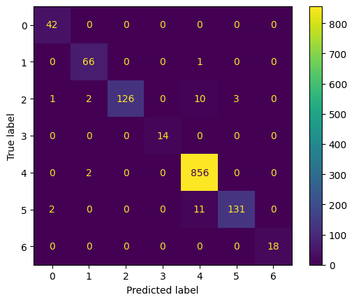
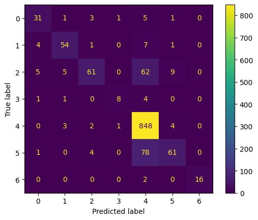
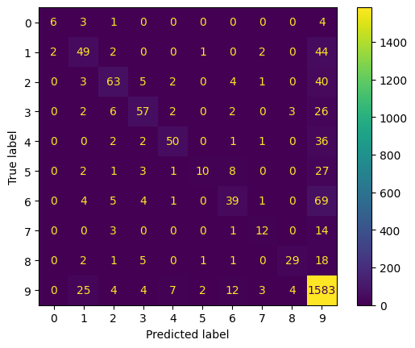
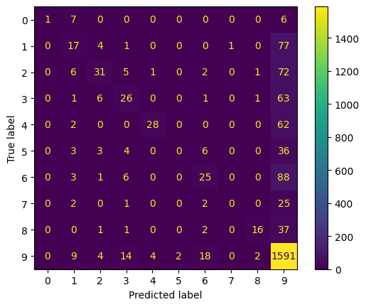
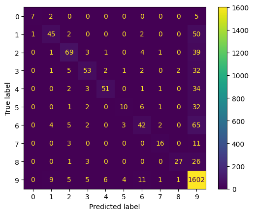

## **Title: "From Skin Cancer to Art: A Journey of Fine-Tuning Vision Transformers and ResNets"**

---

### **1. Introduction**
In the world of medical imaging and art classification, the ability to accurately classify images can have profound implications—whether it’s diagnosing skin cancer or categorizing artistic styles. My journey began with two distinct datasets: **Skin Cancer** and **ArtDL**. The goal was to leverage state-of-the-art deep learning models to achieve high classification performance. However, as with any machine learning project, the path was filled with challenges, debugging, and valuable insights.

---

### **2. The Datasets**
- **Skin Cancer Dataset**: A medical imaging dataset with imbalanced classes, where accurate classification could potentially save lives. The challenge here was to handle class imbalance and ensure the model generalized well.
- **ArtDL Dataset**: A dataset of artistic images, where the goal was to classify images into different artistic styles. This dataset presented its own challenges, including limited samples and high variability in artistic expression.

Both datasets required careful preprocessing and augmentation to ensure the models could learn effectively.

Refer:
- [Dataset Preparation](./data_prepare/data_prepare.md) which has information on how to create tfrecords for each subset (train, test, and validation) for efficient training.
- [MetaData Preparation](./data_prepare/data_prepare.ipynb) notebook which demonstrates how to generate the metadata JSON file required to create tfrecords.

---

### **3. The Models**
I chose two powerful architectures for this task:
- **Vision Transformer (ViT-B16)**: Known for its state-of-the-art performance on ImageNet, ViT-B16 was a natural choice for its ability to capture global context in images ([checkpoint download url](https://storage.googleapis.com/tf_model_garden/vision/vit/vit-deit-imagenet-b16.tar.gz)).
- **ResNet-50**: A classic convolutional neural network (CNN) that has been a workhorse in image classification tasks ([checkpoint download url](https://storage.googleapis.com/tf_model_garden/vision/resnet/resnet-50-i224.tar.gz)). 

The initial plan was to fine-tune these models on the datasets, but the journey was far from straightforward.

---

### **4. The Hardware, Setup, and Configuration**
All experiments were run on an **NVIDIA Titan XP GPU**, leveraging mixed precision training (`float16`) to speed up training and reduce memory usage. The codebase used for this project is based on the [TensorFlow Model Garden](https://github.com/tensorflow/models/tree/master/official), a repository that provides state-of-the-art machine learning models and examples built using TensorFlow. The Model Garden is particularly useful for tasks like image classification, object detection, and natural language processing, as it offers prebuilt implementations of popular architectures and training pipelines.

For this project, I cloned the TensorFlow Model Garden repository to make it easier to modify the source code based on my specific needs. However, you can also install it directly by following the setup and installation instructions provided in the official repository: [TensorFlow Model Garden Installation](https://github.com/tensorflow/models/tree/master?tab=readme-ov-file#installation).

The training parameters, including the optimizer, learning rate schedule, and batch size, were configured using the provided configuration files for both **ResNet-50** and **ViT-B16**. These configuration files allowed for easy tuning and experimentation with different hyperparameters. For more details on the specific parameters used, refer to the respective configuration files:
- [ViT Configuration](./configs/vit_config.yaml)
- [ResNet Configuration](./configs/resnet_config.yaml)

---

### **5. The Challenges**
The journey was not without its hurdles:
- **Understanding the Code Flow**: One of the initial challenges was understanding the overall code flow to identify where and what to tweak. After extensive debugging, I learned that certain configurations, like setting `use_tf_function` and `use_tf_while_loop` to `false`, were necessary to debug the code correctly. 
- **TFRecord Generation**: Another challenge was generating TFRecords for the datasets. I initially tried creating TFRecords from scratch but ran into issues that I couldn’t resolve immediately. As a workaround, I used the existing script from TF Model Garden which was for object detection and modified them to suit the image classification task. Debugging the TFRecord generation process remains a task for another day.
- **Poor Initial Results**: When training the models initially, both models performed poorly. This was a red flag that something was amiss. I tried tweaking a lot for parameters, and even introduced a focal loss, but it did not help. 
- **Checkpoint Woes**: After days of debugging, I realized that the model wasn’t picking up the pretrained checkpoints by default. This was a critical insight—**explicitly loading the pretrained weights** was necessary to achieve meaningful results.
- **Learning Rate Issues**: At one point, the learning rate was stuck at zero due to a misconfigured decay schedule. Fixing this required careful tuning of the `decay_steps` parameter.

These challenges taught me the importance of **meticulous debugging** and the value of **pretrained models** in transfer learning tasks.

---

### **6. The Experiments and Results**

---

#### **Initial Experiments**
Both **ResNet-50** and **Vision Transformer (ViT-B16)** were fine-tuned on the **Skin Cancer** and **ArtDL** datasets using the following configurations:
- **Batch Size**: 16  
- **Loss Function**: Categorical Cross Entropy  
- **Learning Rate**: 0.0001 with a cosine decay schedule  
- **Optimizer**: AdamW  
- **Augmentation**: Random Augmentation (RandAug) with the following parameters:  
  - `cutout_const`: 40  
  - `exclude_ops`: [Cutout]  
- **Training Steps**:  
  - ResNet: 90,000 steps  
  - ViT: 30,000 steps  

For more details on the specific configurations, refer to the respective configuration files:  
- [ViT Configuration](./configs//vit_config.yaml)  
- [ResNet Configuration](./configs//resnet_config.yaml)  

---

#### **Results for Initial Experiments**
The results from the initial experiments are summarized below:

| **Model**       | **Dataset**     | **F1-Score** |
|------------------|-----------------|--------------|
| ViT-B16         | Skin Cancer     | 0.97         |
| ResNet-50       | Skin Cancer     | 0.74         |
| ViT-B16         | ArtDL           | 0.57         |
| ResNet-50       | ArtDL           | 0.31         |

- **Skin Cancer Dataset**:  
  - ViT-B16 achieved an **F1 score of 0.97**, demonstrating its strong performance in medical imaging tasks.  
  - ResNet-50 achieved an **F1 score of 0.74**, which, while lower, still showed reasonable performance.  

- **ArtDL Dataset**:  
  - ViT-B16 achieved an **F1 score of 0.57**, significantly outperforming ResNet-50, which scored **0.31**.  

#### **Experiment 1: ViT on Skin Cancer**
- **Confusion Matrix**:  
  

- **Classification Report**:

| Class | Precision | Recall | F1-Score | Support |
|-------|-----------|--------|----------|---------|
| 0     | 0.93      | 1.00   | 0.97     | 42      |
| 1     | 0.94      | 0.99   | 0.96     | 67      |
| 2     | 1.00      | 0.89   | 0.94     | 142     |
| 3     | 1.00      | 1.00   | 1.00     | 14      |
| 4     | 0.97      | 1.00   | 0.99     | 858     |
| 5     | 0.98      | 0.91   | 0.94     | 144     |
| 6     | 1.00      | 1.00   | 1.00     | 18      |

| **Metric**       | **Macro Avg** | **Weighted Avg** |
|-------------------|---------------|------------------|
| **Precision**     | 0.98          | 0.98             |
| **Recall**        | 0.97          | 0.98             |
| **F1-Score**      | 0.97          | 0.97             |
| **Accuracy**      | 0.98          | -                |

--- 

#### **Experiment 2: ResNet on Skin Cancer**
- **Confusion Matrix**:  
  

- **Classification Report**:

| Class | Precision | Recall | F1-Score | Support |
|-------|-----------|--------|----------|---------|
| 0     | 0.74      | 0.74   | 0.74     | 42      |
| 1     | 0.84      | 0.81   | 0.82     | 67      |
| 2     | 0.86      | 0.43   | 0.57     | 142     |
| 3     | 0.80      | 0.57   | 0.67     | 14      |
| 4     | 0.84      | 0.99   | 0.91     | 858     |
| 5     | 0.80      | 0.42   | 0.55     | 144     |
| 6     | 1.00      | 0.89   | 0.94     | 18      |

| **Metric**       | **Macro Avg** | **Weighted Avg** |
|-------------------|---------------|------------------|
| **Precision**     | 0.84          | 0.84             |
| **Recall**        | 0.69          | 0.84             |
| **F1-Score**      | 0.74          | 0.82             |
| **Accuracy**      | 0.84          | -                |

---

#### **Experiment 3: ViT on ArtDL**
- **Confusion Matrix**:  
  

- **Classification Report**:

| Class | Precision | Recall | F1-Score | Support |
|-------|-----------|--------|----------|---------|
| 0     | 0.75      | 0.43   | 0.55     | 14      |
| 1     | 0.54      | 0.49   | 0.52     | 100     |
| 2     | 0.72      | 0.53   | 0.61     | 118     |
| 3     | 0.71      | 0.58   | 0.64     | 98      |
| 4     | 0.79      | 0.54   | 0.65     | 92      |
| 5     | 0.71      | 0.19   | 0.30     | 52      |
| 6     | 0.57      | 0.32   | 0.41     | 123     |
| 7     | 0.60      | 0.40   | 0.48     | 30      |
| 8     | 0.81      | 0.51   | 0.62     | 57      |
| 9     | 0.85      | 0.96   | 0.90     | 1644    |

| **Metric**       | **Macro Avg** | **Weighted Avg** |
|-------------------|---------------|------------------|
| **Precision**     | 0.71          | 0.80             |
| **Recall**        | 0.50          | 0.82             |
| **F1-Score**      | 0.57          | 0.80             |
| **Accuracy**      | 0.82          | -                |

---

#### **Experiment 4: ResNet on ArtDL**
- **Confusion Matrix**:  
  

- **Classification Report**:

| Class | Precision | Recall | F1-Score | Support |
|-------|-----------|--------|----------|---------|
| 0     | 1.00      | 0.07   | 0.13     | 14      |
| 1     | 0.34      | 0.17   | 0.23     | 100     |
| 2     | 0.62      | 0.26   | 0.37     | 118     |
| 3     | 0.45      | 0.27   | 0.33     | 98      |
| 4     | 0.85      | 0.30   | 0.45     | 92      |
| 5     | 0.00      | 0.00   | 0.00     | 52      |
| 6     | 0.45      | 0.20   | 0.28     | 123     |
| 7     | 0.00      | 0.00   | 0.00     | 30      |
| 8     | 0.80      | 0.28   | 0.42     | 57      |
| 9     | 0.77      | 0.97   | 0.86     | 1644    |

| **Metric**       | **Macro Avg** | **Weighted Avg** |
|-------------------|---------------|------------------|
| **Precision**     | 0.53          | 0.69             |
| **Recall**        | 0.25          | 0.75             |
| **F1-Score**      | 0.31          | 0.69             |
| **Accuracy**      | 0.75          | -                |

---

While the results on ArtDL were lower than on Skin Cancer, they demonstrated the potential for improving performance through hyperparameter tuning and further experimentation.  

Given that ViT consistently outperformed ResNet (even after training for less steps) across both datasets, further experiments focused on tuning hyperparameters and improving the performance of **ViT-B16**.  

---

#### **Hyperparameter Tuning Experiments**
To analyze the impact of various hyperparameters, we conducted experiments with the following configurations:

| **Hyperparameter**       | **Values Tested**                                                                 |
|--------------------------|----------------------------------------------------------------------------------|
| **Batch Size**           | 16, 32                                                                          |
| **Loss Function**        | Cross Entropy, Weighted Cross Entropy, Focal Loss, Weighted Focal Loss           |
| **Augmentation**         | RandAug, RandAug + (Mixup + CutMix)                                             |
| **Learning Rate**        | 0.0001, 0.01, 0.00005, 0.0002                                                  |

---

#### **Summary of Results**
The results of these experiments are summarized in the table below:

| **Hyperparameter**       | **Configuration**               | **F1-Score** |
|--------------------------|---------------------------------|--------------|
| Batch Size               | 16                              | 0.57         |
|                          | 32                              | 0.56         |
| Loss Function            | Cross Entropy                   | 0.57         |
|                          | Weighted Cross Entropy          | 0.4          |
|                          | Focal Loss                      | 0.6          |
|                          | Weighted Focal Loss             | 0.56         |
| Augmentation             | RandAug                         | 0.6          |
|                          | RandAug + (Mixup + CutMix)      | 0.46         |
| Learning Rate            | 0.0001                          | 0.6          |
|                          | 0.01                            | 0            |
|                          | 0.00005                         | 0.58         |
|                          | 0.0002                          | 0.49         |

---

#### **Results from Best Configuration**
The best results were achieved with the following configuration:
- **Batch Size**: 16  
- **Loss Function**: Focal Loss  
- **Augmentation**: RandAug  
- **Learning Rate**: 0.0001  

---

- **Confusion Matrix**:  
  

- **Classification Report**:

| Class | Precision | Recall | F1-Score | Support |
|-------|-----------|--------|----------|---------|
| 0     | 0.88      | 0.50   | 0.64     | 14      |
| 1     | 0.73      | 0.45   | 0.56     | 100     |
| 2     | 0.74      | 0.58   | 0.65     | 118     |
| 3     | 0.75      | 0.54   | 0.63     | 98      |
| 4     | 0.85      | 0.55   | 0.67     | 92      |
| 5     | 0.56      | 0.19   | 0.29     | 52      |
| 6     | 0.62      | 0.34   | 0.44     | 123     |
| 7     | 0.73      | 0.53   | 0.62     | 30      |
| 8     | 0.90      | 0.47   | 0.62     | 57      |
| 9     | 0.84      | 0.97   | 0.91     | 1644    |

| **Metric**       | **Macro Avg** | **Weighted Avg** |
|-------------------|---------------|------------------|
| **Precision**     | 0.76          | 0.81             |
| **Recall**        | 0.51          | 0.83             |
| **F1-Score**      | 0.60          | 0.81             |
| **Accuracy**      | 0.83          | -                |

For detailed results of all the experiments, refer to [evaluation](./docs/evaluation.ipynb) notebook.

---

### **7. Insights and Learnings**
- **Pretrained Models Are Crucial**: Fine-tuning pretrained models was essential for achieving good results, especially on small datasets like ArtDL.
- **ViT Outperforms ResNet**: Across both datasets, ViT-B16 consistently outperformed ResNet-50, likely due to its ability to capture global context and long-range dependencies in images.

---

### **8. Future Work**

1. **Explainability**:
   - Use **attention visualization** techniques to understand what parts of the image the ViT model is focusing on, especially for artistic images.

---

### **9. Conclusion**
This journey from debugging to achieving strong results has been both challenging and rewarding. The experiments demonstrated the power of Vision Transformers, especially in domains like medical imaging and art classification. Through extensive hyperparameter tuning, we identified the optimal configuration for ViT-B16, achieving the best results with a **batch size of 16**, **focal loss**, **RandAug augmentation**, and a **learning rate of 0.0001**. These findings highlight the importance of careful experimentation and tuning in achieving state-of-the-art performance.

While the results on the **Skin Cancer dataset** were highly promising, the **ArtDL dataset** presented unique challenges, underscoring the need for further exploration into handling class imbalance and improving generalization on artistic datasets. The insights gained from this project provide a solid foundation for future improvements, and I look forward to exploring advanced techniques such as **attention visualization**, and **self-supervised learning** to push the boundaries of image classification even further.

### **10. References**
1. [TensorFlow Models Repository](https://github.com/tensorflow/models)
2. [Skin Cancer Dataset](https://huggingface.co/datasets/marmal88/skin_cancer)
3. [Art DL Dataset](https://artdl.org/)
4. [ResNet Checkpoint](https://storage.googleapis.com/tf_model_garden/vision/resnet/resnet-50-i224.tar.gz)
5. [Vision Transformer Checkpoint](https://storage.googleapis.com/tf_model_garden/vision/vit/vit-deit-imagenet-b16.tar.gz)
6. [Image Classification Guide](https://www.tensorflow.org/tfmodels/vision/image_classification)