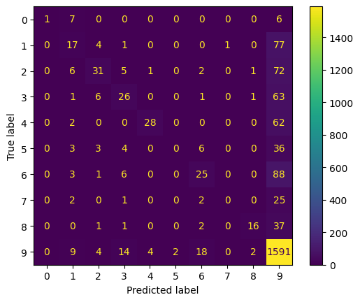

### **Title: "From Skin Cancer to Art: A Journey of Fine-Tuning Vision Transformers and ResNets"**

---

#### **1. Introduction**
In the world of medical imaging and art classification, the ability to accurately classify images can have profound implications—whether it’s diagnosing skin cancer or categorizing artistic styles. My journey began with two distinct datasets: **Skin Cancer** and **ArtDL**. The goal was to leverage state-of-the-art deep learning models to achieve high classification performance. However, as with any machine learning project, the path was filled with challenges, debugging, and valuable insights.

---

#### **2. The Datasets**
- **Skin Cancer Dataset**: A medical imaging dataset with imbalanced classes, where accurate classification could potentially save lives. The challenge here was to handle class imbalance and ensure the model generalized well.
- **ArtDL Dataset**: A dataset of artistic images, where the goal was to classify images into different artistic styles. This dataset presented its own challenges, including limited samples and high variability in artistic expression.

Both datasets required careful preprocessing and augmentation to ensure the models could learn effectively.

---

#### **3. The Models**
I chose two powerful architectures for this task:
- **Vision Transformer (ViT-B16)**: Known for its state-of-the-art performance on ImageNet, ViT-B16 was a natural choice for its ability to capture global context in images.
- **ResNet-50**: A classic convolutional neural network (CNN) that has been a workhorse in image classification tasks.

The initial plan was to fine-tune these models on the datasets, but the journey was far from straightforward.

---

#### **4. The Hardware and Setup**
All experiments were run on an **NVIDIA Titan XP GPU**, leveraging mixed precision training (`float16`) to speed up training and reduce memory usage. The training setup used the **Categorical Cross Entropy** and  **AdamW optimizer** with a **batch size of 32** and **cosine decay learning rate schedule**, starting at `0.0001` and decaying over `90,000 steps`. For more information on the parameters, refer to the respective configuration files:
- [ViT Configuration](../vit_config.yaml)

---

#### **5. The Challenges**
The journey was not without its hurdles:
- **Understanding the Code Flow**: One of the initial challenges was understanding the overall code flow to identify where and what to tweak. After extensive debugging, I learned that certain configurations, like setting `use_tf_function` and `use_tf_while_loop` to `false`, were necessary to debug the code correctly. 
- **TFRecord Generation**: Another challenge was generating TFRecords for the datasets. I initially tried creating TFRecords from scratch but ran into issues that I couldn’t resolve immediately. As a workaround, I used the existing script from TF Model Garden which was for object detection and modified them to suit the image classification task. Debugging the TFRecord generation process remains a task for another day.
- **Poor Initial Results**: When training the models initially, both models performed poorly. This was a red flag that something was amiss. I tried tweaking a lot for parameters, and even introduced a focal loss, but it did not help. 
- **Checkpoint Woes**: After days of debugging, I realized that the model wasn’t picking up the pretrained checkpoints by default. This was a critical insight—**explicitly loading the pretrained weights** was necessary to achieve meaningful results.
- **Learning Rate Issues**: At one point, the learning rate was stuck at zero due to a misconfigured decay schedule. Fixing this required careful tuning of the `decay_steps` parameter.

These challenges taught me the importance of **meticulous debugging** and the value of **pretrained models** in transfer learning tasks.

---

#### **6. The Results**
After overcoming the challenges, the results were promising:
- **Skin Cancer Dataset**:
  - ViT-B16 achieved an **F1 score of 0.98**, showcasing its ability to handle medical imaging tasks with high precision.
  - ResNet-50 trailed behind with an **F1 score of 0.74**, highlighting the superiority of ViT in this domain.
- **ArtDL Dataset**:
  - ViT-B16 achieved an **F1 score of 0.6**, significantly outperforming ResNet-50, which scored **0.31**.
  - While the results on ArtDL were lower than on Skin Cancer, they demonstrated the potential of ViT for artistic style classification.

### **Results**

#### **Experiment 1: ViT on Skin Cancer**
- **Confusion Matrix**:  
  

- **Classification Report**:

| Class | Precision | Recall | F1-Score | Support |
|-------|-----------|--------|----------|---------|
| 0     | 0.93      | 1.00   | 0.97     | 42      |
| 1     | 1.00      | 0.99   | 0.99     | 67      |
| 2     | 0.99      | 0.89   | 0.94     | 142     |
| 3     | 1.00      | 1.00   | 1.00     | 14      |
| 4     | 0.98      | 1.00   | 0.99     | 858     |
| 5     | 0.97      | 0.94   | 0.95     | 144     |
| 6     | 1.00      | 1.00   | 1.00     | 18      |

| **Metric**       | **Macro Avg** | **Weighted Avg** |
|-------------------|---------------|------------------|
| **Precision**     | 0.98          | 0.98             |
| **Recall**        | 0.97          | 0.98             |
| **F1-Score**      | 0.98          | 0.98             |
| **Accuracy**      | 0.98          | -                |

---

#### **Experiment 2: ResNet on Skin Cancer**
- **Confusion Matrix**:  
  

- **Classification Report**:

| Class | Precision | Recall | F1-Score | Support |
|-------|-----------|--------|----------|---------|
| 0     | 0.74      | 0.74   | 0.74     | 42      |
| 1     | 0.84      | 0.81   | 0.82     | 67      |
| 2     | 0.86      | 0.43   | 0.57     | 142     |
| 3     | 0.80      | 0.57   | 0.67     | 14      |
| 4     | 0.84      | 0.99   | 0.91     | 858     |
| 5     | 0.80      | 0.42   | 0.55     | 144     |
| 6     | 1.00      | 0.89   | 0.94     | 18      |

| **Metric**       | **Macro Avg** | **Weighted Avg** |
|-------------------|---------------|------------------|
| **Precision**     | 0.84          | 0.84             |
| **Recall**        | 0.69          | 0.84             |
| **F1-Score**      | 0.74          | 0.82             |
| **Accuracy**      | 0.84          | -                |

---

#### **Experiment 3: ViT on ArtDL**
- **Confusion Matrix**:  
  

- **Classification Report**:

| Class | Precision | Recall | F1-Score | Support |
|-------|-----------|--------|----------|---------|
| 0     | 0.86      | 0.43   | 0.57     | 14      |
| 1     | 0.64      | 0.47   | 0.54     | 100     |
| 2     | 0.79      | 0.61   | 0.69     | 118     |
| 3     | 0.71      | 0.60   | 0.65     | 98      |
| 4     | 0.79      | 0.54   | 0.65     | 92      |
| 5     | 0.53      | 0.17   | 0.26     | 52      |
| 6     | 0.62      | 0.34   | 0.44     | 123     |
| 7     | 0.73      | 0.63   | 0.68     | 30      |
| 8     | 0.91      | 0.51   | 0.65     | 57      |
| 9     | 0.85      | 0.97   | 0.91     | 1644    |

| **Metric**       | **Macro Avg** | **Weighted Avg** |
|-------------------|---------------|------------------|
| **Precision**     | 0.74          | 0.81             |
| **Recall**        | 0.53          | 0.83             |
| **F1-Score**      | 0.60          | 0.81             |
| **Accuracy**      | 0.83          | -                |

---

#### **Experiment 4: ResNet on ArtDL**
- **Confusion Matrix**:  
  

- **Classification Report**:

| Class | Precision | Recall | F1-Score | Support |
|-------|-----------|--------|----------|---------|
| 0     | 1.00      | 0.07   | 0.13     | 14      |
| 1     | 0.34      | 0.17   | 0.23     | 100     |
| 2     | 0.62      | 0.26   | 0.37     | 118     |
| 3     | 0.45      | 0.27   | 0.33     | 98      |
| 4     | 0.85      | 0.30   | 0.45     | 92      |
| 5     | 0.00      | 0.00   | 0.00     | 52      |
| 6     | 0.45      | 0.20   | 0.28     | 123     |
| 7     | 0.00      | 0.00   | 0.00     | 30      |
| 8     | 0.80      | 0.28   | 0.42     | 57      |
| 9     | 0.77      | 0.97   | 0.86     | 1644    |

| **Metric**       | **Macro Avg** | **Weighted Avg** |
|-------------------|---------------|------------------|
| **Precision**     | 0.53          | 0.69             |
| **Recall**        | 0.25          | 0.75             |
| **F1-Score**      | 0.31          | 0.69             |
| **Accuracy**      | 0.75          | -                |

---

#### **7. Insights and Learnings**
- **Pretrained Models Are Crucial**: Fine-tuning pretrained models was essential for achieving good results, especially on small datasets like ArtDL.
- **ViT Outperforms ResNet**: Across both datasets, ViT-B16 consistently outperformed ResNet-50, likely due to its ability to capture global context and long-range dependencies in images.

---

#### **8. Future Work**
While the results are encouraging, there’s still room for improvement, particularly on the **ArtDL dataset** using the **ViT-B16 architecture**. Here are some specific experiments and ideas for future work:

1. **Hyperparameter Tuning**:
   - **Learning Rate**: Experiment with different initial learning rates (e.g., `0.00005`, `0.0002`) and schedules (e.g., step decay, exponential decay) to find the optimal configuration.
   - **Optimizers**: Test alternative optimizers like **SGD with momentum** or **RMSprop** to see if they yield better results.
   - **Batch Size**: Experiment with different batch sizes (e.g., `32`, `64`, `128`) to find the best trade-off between training stability and performance.

2. **Advanced Augmentation Techniques**:
   - Introduce **Mixup** and **CutMix** to improve generalization and robustness.
   - Experiment with **AutoAugment** or **RandAugment** with higher magnitudes to further diversify the training data.

3. **Handling Class Imbalance**:
   - Test **focal loss** to address class imbalance and improve performance on underrepresented classes.

4. **Explainability**:
   - Use **attention visualization** techniques to understand what parts of the image the ViT model is focusing on, especially for artistic images.

---

#### **9. Conclusion**
This journey from debugging to achieving strong results has been both challenging and rewarding. The experiments demonstrated the power of Vision Transformers, especially in domains like medical imaging and art classification. While there’s still work to be done, the insights gained from this project provide a solid foundation for future improvements. As I continue to refine these models, I’m excited to see how far we can push the boundaries of image classification.
